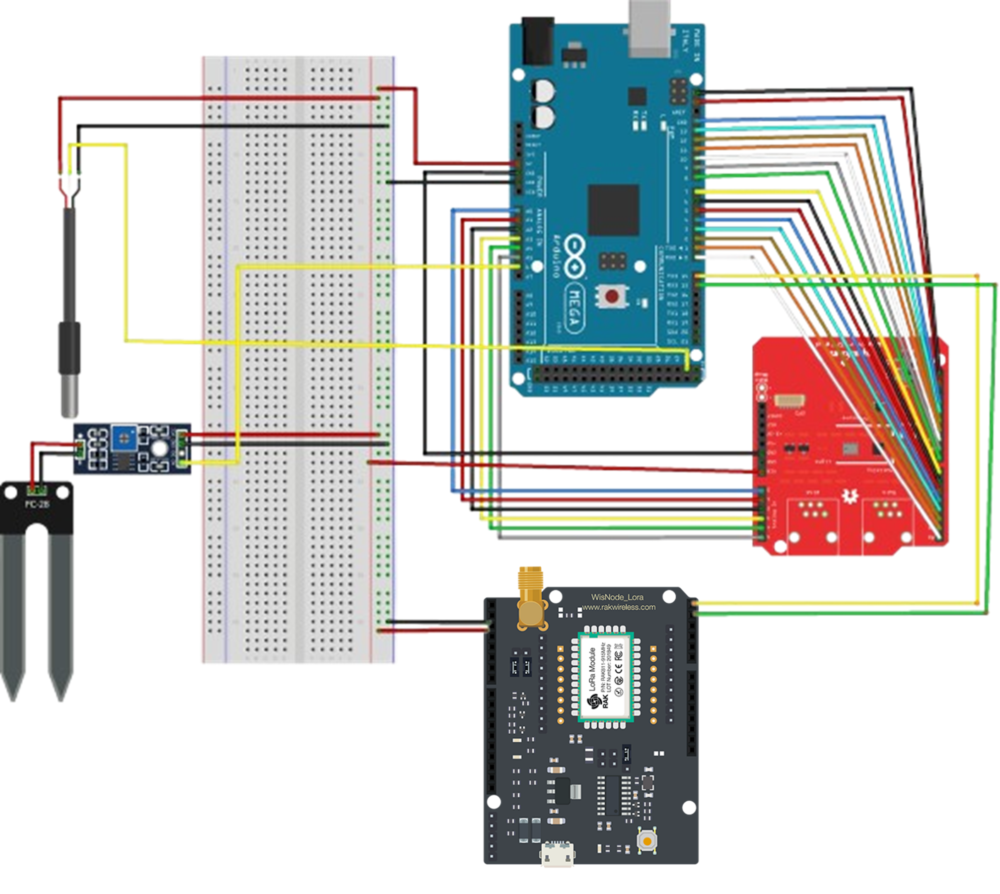
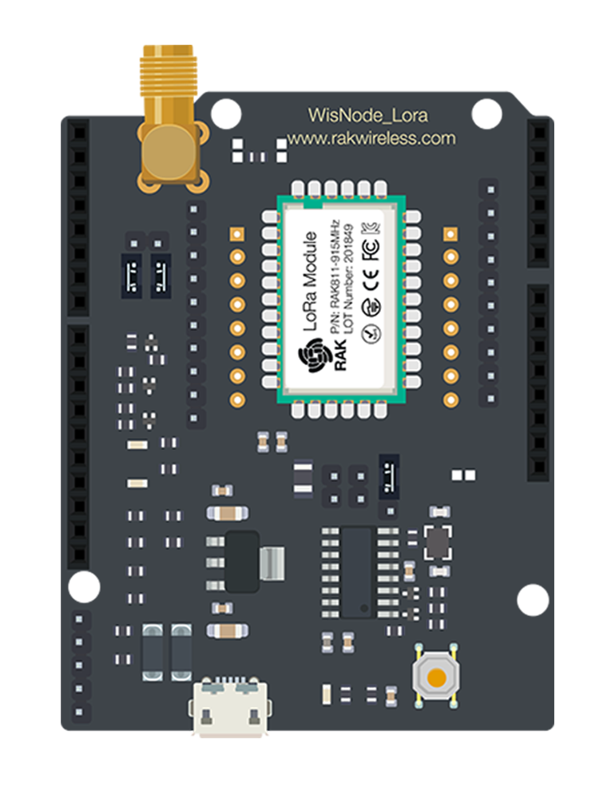
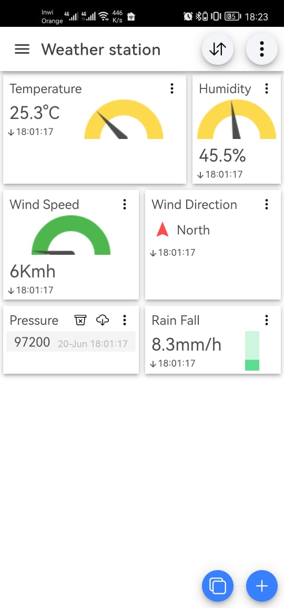

# Smart Weather Station for Connected Greenhouse

.png)

This project implements a LoRaWAN-connected weather station designed to monitor external climate conditions for an intelligent greenhouse system. The station collects comprehensive meteorological data and transmits it via LoRaWAN to a central system for automated greenhouse parameter adjustments.

## Key Features

- Real-time monitoring of:
  - Air temperature (°C)
  - Relative humidity (%)
  - Atmospheric pressure (hPa)
  - Wind speed (m/s) and direction (°)
  - Rainfall (mm)
  - Soil temperature and humidity
  - Light levels

- LoRaWAN connectivity using OTAA activation
- Data transmission to ChirpStack server
- MQTT integration for system-wide data sharing
- Automated JSON payload generation and decoding

## Hardware Components

| Component | Model | Function |
|-----------|-------|----------|
| Microcontroller | Arduino Mega 2560 | Central processing unit |
| Weather Shield | SparkFun Weather Shield | Environmental sensors |
| Anemometer/Wind Vane | Integrated with Weather Shield | Wind measurement |
| Rain Gauge | Integrated with Weather Shield | Precipitation measurement |
| LoRa Module | RAK811 | LoRaWAN communication |
| LoRa Gateway | RAK7243 | Network gateway |
| Server Platform | ChirpStack | Network and application server |
| MQTT Broker | Mosquitto | Data distribution |

## Software Architecture

1. **Sensor Data Collection**
   - Arduino Mega reads data from multiple environmental sensors
   - Interrupt handlers for precise wind and rain measurements

2. **Data Processing**
   - Calculates averages (2-min wind speed, 10-min gusts)
   - Converts units and formats data

3. **LoRaWAN Transmission**
   - OTAA activation for secure joining
   - Data sent as hex-encoded JSON payloads

4. **Server Processing**
   - ChirpStack handles device management and data decoding
   - MQTT broker distributes data to other systems

5. **Data Visualization**
   - Dashboard integration (Node-RED, Mobile app )
    
## Installation & Setup

### Hardware Setup
1. Connect SparkFun Weather Shield to Arduino Mega
2. Attach wind vane, anemometer, and rain gauge
3. Connect RAK811 LoRa module via serial interface
4. Power the system (battery or wired)

### Software Setup
1. Upload Arduino sketch (`Weather_Station_LoraCom.ino`) to Mega
2. Configure RAK811 module with AT commands: