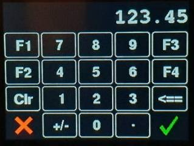

# TouchKeypad

A library for Arduino/Teensy etc that provides (relatively) easy creation of a keypad touch interface with events fired (touch and repeat touch) with visual feedback of touch interactions.

Each key can be assigned its own touch callback handler (or use a common one) and the display class can also have a draw function attached for icons etc..


## DisplayTouchKeypad Class

A subclass of TouchKeypad (below).



Requires Adafruit's [GFX library](https://github.com/adafruit/Adafruit-GFX-Library) (or rather, a subclass of it for your display).

This is the class that actually draws stuff on the display - either instantiate or subclass this one.


The ```update(uint16_t touchUpdateMs=10)``` and ```draw(uint16_t displayRefreshMs=100)``` methods are provide separately as it is often necessary to control the timing of drawing.
Both accept a milliseconds parameter to limit update/draw frequency.


An ```updateAndDraw()``` method is provided for convenience.

See methods in ```TouchKeypad``` class below to configure your touchscreen parameters.


## TouchKeypad Class

Creates a keypad of ```TouchKey```s

Extends the [```DisplayUtils```](https://github.com/Stutchbury/DisplayUtils) Area


Requires Adafruit's [```TouchScreen.h```](https://github.com/adafruit/Adafruit_TouchScreen)

### Setup

**```void rotate()```** Unlike the GFX display, this does not take any arguments, it just rotates the touch screen 90 degrees clockwise.

The touchscreen is highly likely to at a completetely different native rotation to the actual (display) screen and also be (internally) wired back-to-front in x and/or y.

To deal with this we have ```flipX()``` & ```flipY()``` as below.

If required, call ```rotate()``` just once and then use ```flipX()``` and/or ```flipY()``` to match the display.  

**```void flipX()```** Swap tsLeft & tsRight boundaries

**```void flipY()```** Swap tsTop & tsBottom boundaries


## TouchKey Class

Created automagically by the ```TouchKeypad``` class, this would not normally be instatiated outside of that context.

The area of each key will be able to be changed (but not in this release).

Extends the [```DisplayUtils```](https://github.com/Stutchbury/DisplayUtils) Area


